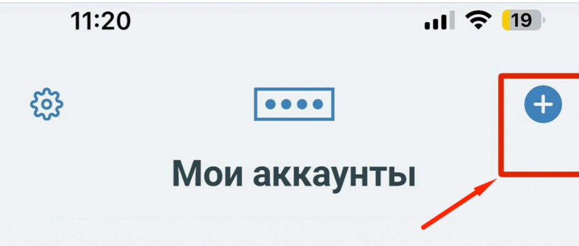
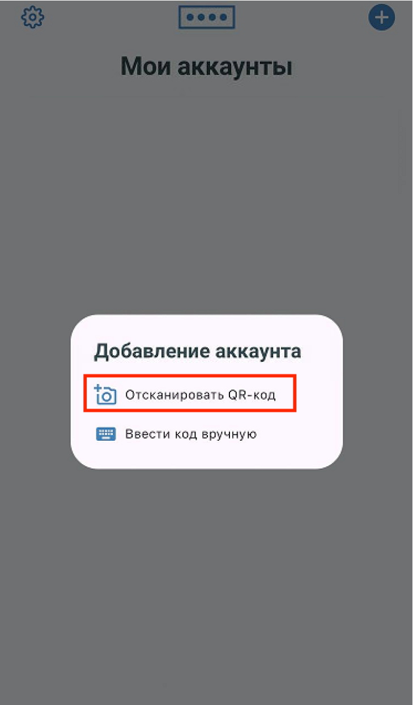
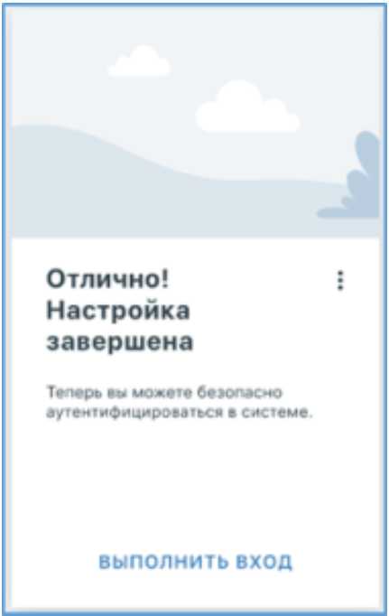
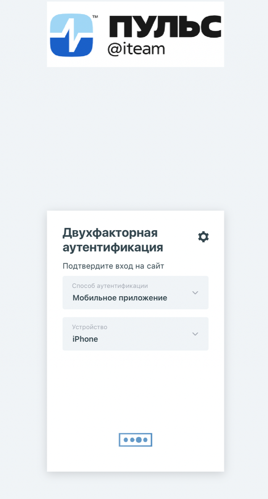
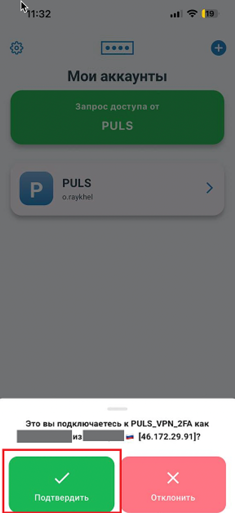

# Настройка двухфакторной аутентификации с приложением Multifactor

После успешной смены пароля на сайте вам будет предложено включить двухфакторную аутентификацию.  
Следуйте инструкции, чтобы завершить настройку.

1. Откройте приложение **Multifactor** на телефоне и нажмите значок **«+»** в правом верхнем углу.  

2. Выберите пункт **«Отсканировать QR-код»**.  

3. Наведите камеру телефона на QR-код в окне браузера, чтобы отсканировать его.

4. В приложении **Multifactor** появится аккаунт `PULS` с вашим логином.  
   Вы получите уведомление об успешной привязке. Нажмите **«Выполнить вход»**.  
   

5. В браузере откроется окно двухфакторной аутентификации.  
   

6. На вашем телефоне появится уведомление с запросом подтверждения входа.  
    Нажмите **«Подтвердить»**, чтобы завершить вход.  
    Вас автоматически перенаправят в веб-версию почтового клиента.

> ⚠️ **Если уведомление не пришло:**
> - Откройте приложение **Multifactor** вручную.  
> - Найдите аккаунт `PULS` и подтвердите вход через интерфейс приложения.

## Важно!

❌ **Не удаляйте приложение Multifactor** — оно необходимо для подтверждения каждого входа в систему.

