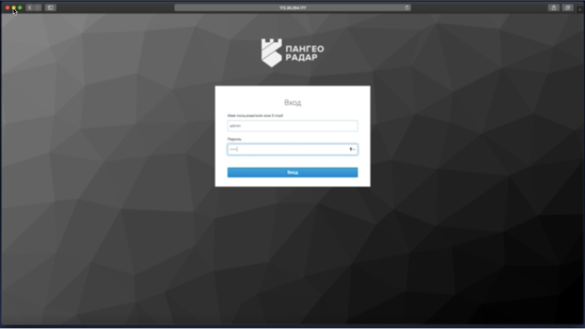
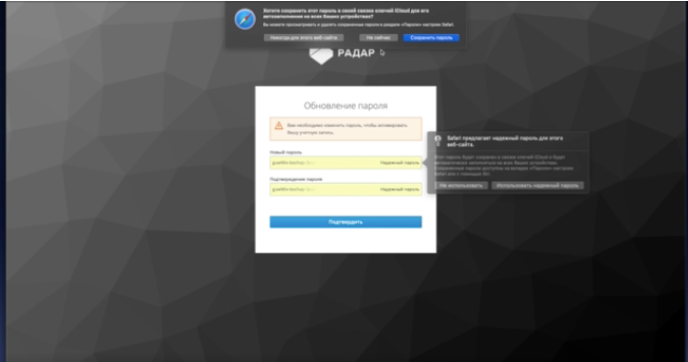
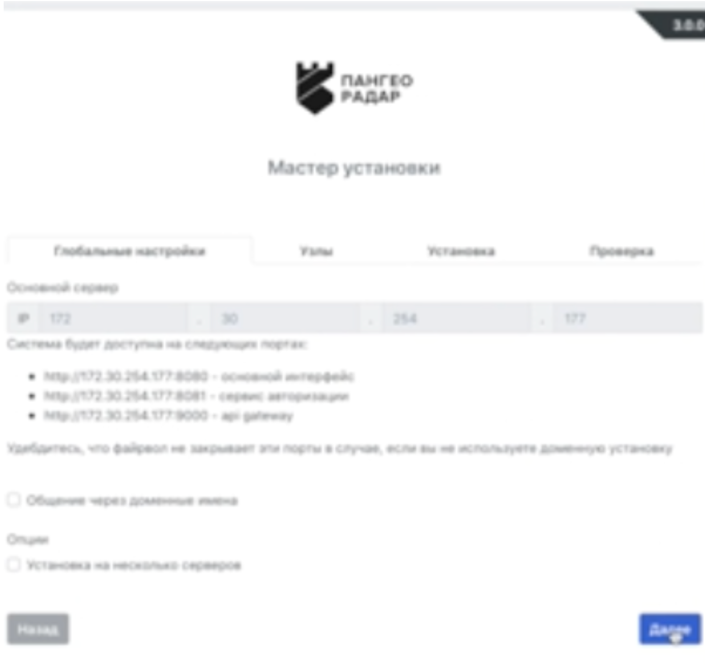

# Инструкция по установке Платформы "Радар"

## Запуск скрипта установки

Чтобы установить платформу, выполните следующие действия:

1. Выполните команду:
   ```bash
   bash install.sh

2. Дождитесь распаковки установочного архива и выберите тип установки — "Первичная установка".
3. Введите IP-адрес, по которому будет выполняться подключение к Платформе.
После завершения установки будет выведено сообщение об успешной установке и рекомендация о продолжении. 

## Работа с Мастером установки Платформы

1. Чтобы запустить Мастер установки, перейдите по адресу, указанному при завершении работы скрипта установки: *http://<IP-адрес>:<порт маршрутизации>/install*.
1. В открывшемся окне авторизации введите логин и пароль, установленные по умолчанию.

1. Обязательно смените пароль пользователя.

После смены пароля откроется экран Мастера установки Платформы.
1. Нажмите кнопку "Далее", чтобы перейти к экрану добавления узлов.

1. В поле "Добавление ролей к узлам" поочередно добавьте следующие роли:
- master
- data
- monitoring
- worker
- infra
- backup
- balancer
- correlator
Нажмите "Далее".

6. В открывшемся окне нажмите "Начать установку".

1. После завершения установки откроется экран проверки статусов компонентов. Убедитесь, что все компоненты установлены корректно. 
Статусы отображаются с помощью цветовой градации: зелёный — успешно, красный — ошибка. 
Если все компоненты установлены корректно, установка считается завершенной. 
