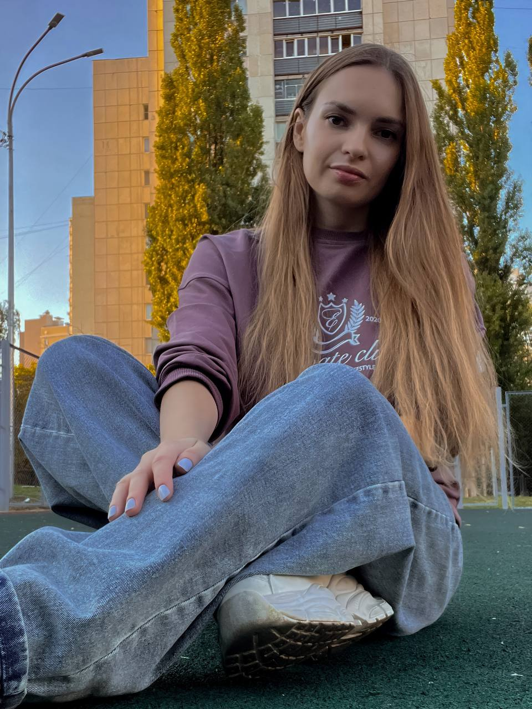

---
hide:
  - toc
  - navigation
---

# Добро пожаловать на мой портал

  

    
  

  

  
  ## О себе

   Привет! Меня зовут Ольга, я – технический писатель с 9-летним опытом создания документации для IT-систем в медицине, фармацевтике и городской инфраструктуре. 
   
   Работала с 1С, мобильными приложениями и web-порталами, превращая сложные технологии в удобные инструкции для пользователей и технических специалистов. 
   
   Создавала базы знаний с нуля, разрабатывала шаблоны, стайлгайды и внедряла процессы для более продуктивной работы с документацией в компании. 
   Есть опыт руководства группой технических писателей: постановки задач, контроля качества документации и обучения сотрудников. 

   Самостоятельно осваиваю docs-as-code, чтобы сделать документацию частью разработки, а не её финальным этапом.
  

---

## Контакты

📧 [example@email.com](mailto:example@email.com)  
📱 Telegram: [@yourusername](https://t.me/yourusername)  
🐙 GitHub: [github.com/yourusername](https://github.com/yourusername)  
💼 LinkedIn: [linkedin.com/in/yourprofile](https://linkedin.com/in/yourprofile)

---

  <a href="../docs/admin/" class="md-button md-button--primary">Примеры документации</a>
  <a href="../docs/courses/" class="md-button md-button--primary">Пройденные курсы </a>

